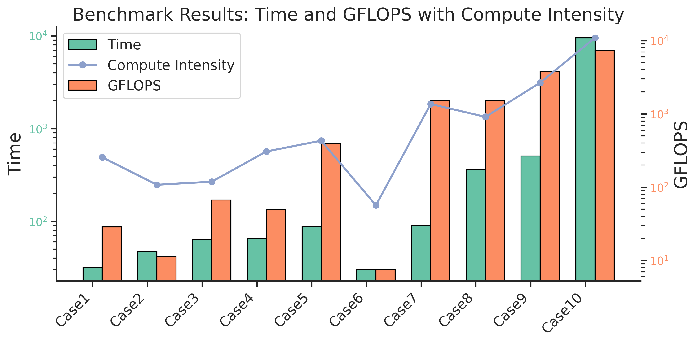

# 更改说明
更改了hgemm_compare.cu与hgemm.cu中的核函数，并通过修改主函数在本地进行了初步的测试

测试结果表示，该核函数的计算rel-error < 0.05，但gflops存在虚高的问题

在local_test文件夹中有我本地测试的代码与说明

## 7月15号更新

样例1、4、6的误差问题仍未解决。

运行结果：

=== Testing Case1 (M=768, N=768, K=768) ===

GRID_DIM:144 BLOCK_DIM:512

[WMMA] iter 0: 1.447936 ms elapsed, 1.447936 ms min.

[WMMA] iter 1: 0.365568 ms elapsed, 0.365568 ms min.

[WMMA] iter 2: 0.353280 ms elapsed, 0.353280 ms min.

[WMMA] iter 3: 0.360448 ms elapsed, 0.353280 ms min.

[WMMA] iter 4: 0.357376 ms elapsed, 0.353280 ms min.

[cuBLAS] iter 0: 3.306464 ms elapsed, 3.306464 ms min.

[cuBLAS] iter 1: 3.258688 ms elapsed, 3.258688 ms min.

[cuBLAS] iter 2: 3.247520 ms elapsed, 3.247520 ms min.

[cuBLAS] iter 3: 3.284768 ms elapsed, 3.247520 ms min.

[cuBLAS] iter 4: 3.238976 ms elapsed, 3.238976 ms min.

Relative error between WMMA and cuBLAS results: 0.125002

Validation FAILED (rel_error >= 0.05)

Performance comparison:

WMMA min time: 0.35328 ms

cuBLAS min time: 3.23898 ms


=== Testing Case2 (M=128, N=1024, K=2048) ===

GRID_DIM:32 BLOCK_DIM:512

[WMMA] iter 0: 1.536000 ms elapsed, 1.536000 ms min.

[WMMA] iter 1: 0.267264 ms elapsed, 0.267264 ms min.

[WMMA] iter 2: 0.265216 ms elapsed, 0.265216 ms min.

[WMMA] iter 3: 0.264192 ms elapsed, 0.264192 ms min.

[WMMA] iter 4: 0.265216 ms elapsed, 0.264192 ms min.

[cuBLAS] iter 0: 3.195648 ms elapsed, 3.195648 ms min.

[cuBLAS] iter 1: 3.193024 ms elapsed, 3.193024 ms min.

[cuBLAS] iter 2: 3.187072 ms elapsed, 3.187072 ms min.

[cuBLAS] iter 3: 3.192064 ms elapsed, 3.187072 ms min.

[cuBLAS] iter 4: 3.191808 ms elapsed, 3.187072 ms min.

Relative error between WMMA and cuBLAS results: 0.0468769

Validation PASSED (rel_error < 0.05)

Performance comparison:

WMMA min time: 0.264192 ms

cuBLAS min time: 3.18707 ms


=== Testing Case3 (M=128, N=2048, K=8192) ===

GRID_DIM:64 BLOCK_DIM:512

[WMMA] iter 0: 10.387456 ms elapsed, 10.387456 ms min.

[WMMA] iter 1: 2.258944 ms elapsed, 2.258944 ms min.

[WMMA] iter 2: 2.232320 ms elapsed, 2.232320 ms min.

[WMMA] iter 3: 2.252800 ms elapsed, 2.232320 ms min.

[WMMA] iter 4: 2.234368 ms elapsed, 2.232320 ms min.

[cuBLAS] iter 0: 18.022017 ms elapsed, 18.022017 ms min.

[cuBLAS] iter 1: 17.991680 ms elapsed, 17.991680 ms min.

[cuBLAS] iter 2: 17.938688 ms elapsed, 17.938688 ms min.

[cuBLAS] iter 3: 18.003231 ms elapsed, 17.938688 ms min.

[cuBLAS] iter 4: 18.018145 ms elapsed, 17.938688 ms min.

Relative error between WMMA and cuBLAS results: 0.0117154

Validation PASSED (rel_error < 0.05)

Performance comparison:

WMMA min time: 2.23232 ms

cuBLAS min time: 17.9387 ms


=== Testing Case4 (M=512, N=3072, K=1024) ===

GRID_DIM:384 BLOCK_DIM:512

[WMMA] iter 0: 3.598336 ms elapsed, 3.598336 ms min.

[WMMA] iter 1: 1.420288 ms elapsed, 1.420288 ms min.

[WMMA] iter 2: 1.410048 ms elapsed, 1.410048 ms min.

[WMMA] iter 3: 1.420288 ms elapsed, 1.410048 ms min.

[WMMA] iter 4: 1.434624 ms elapsed, 1.410048 ms min.

[cuBLAS] iter 0: 6.338112 ms elapsed, 6.338112 ms min.

[cuBLAS] iter 1: 6.297696 ms elapsed, 6.297696 ms min.

[cuBLAS] iter 2: 6.272384 ms elapsed, 6.272384 ms min.

[cuBLAS] iter 3: 6.265888 ms elapsed, 6.265888 ms min.

[cuBLAS] iter 4: 6.256608 ms elapsed, 6.256608 ms min.

Relative error between WMMA and cuBLAS results: 0.0939847

Validation FAILED (rel_error >= 0.05)

Performance comparison:

WMMA min time: 1.41005 ms

cuBLAS min time: 6.25661 ms


=== Testing Case5 (M=512, N=4096, K=8192) ===

GRID_DIM:512 BLOCK_DIM:512

[WMMA] iter 0: 34.558975 ms elapsed, 34.558975 ms min.

[WMMA] iter 1: 19.034113 ms elapsed, 19.034113 ms min.

[WMMA] iter 2: 19.234816 ms elapsed, 19.034113 ms min.

[WMMA] iter 3: 19.366913 ms elapsed, 19.034113 ms min.

[WMMA] iter 4: 19.042303 ms elapsed, 19.034113 ms min.

[cuBLAS] iter 0: 39.943329 ms elapsed, 39.943329 ms min.

[cuBLAS] iter 1: 39.910786 ms elapsed, 39.910786 ms min.

[cuBLAS] iter 2: 39.857697 ms elapsed, 39.857697 ms min.

[cuBLAS] iter 3: 39.776928 ms elapsed, 39.776928 ms min.

[cuBLAS] iter 4: 39.695873 ms elapsed, 39.695873 ms min.

Relative error between WMMA and cuBLAS results: 0.0117687

Validation PASSED (rel_error < 0.05)

Performance comparison:

WMMA min time: 19.0341 ms

cuBLAS min time: 39.6959 ms


=== Testing Case6 (M=3136, N=576, K=64) ===

GRID_DIM:441 BLOCK_DIM:512

[WMMA] iter 0: 1.468416 ms elapsed, 1.468416 ms min.

[WMMA] iter 1: 0.108544 ms elapsed, 0.108544 ms min.

[WMMA] iter 2: 0.110592 ms elapsed, 0.108544 ms min.

[WMMA] iter 3: 0.106496 ms elapsed, 0.106496 ms min.

[WMMA] iter 4: 0.106496 ms elapsed, 0.106496 ms min.

[cuBLAS] iter 0: 2.899840 ms elapsed, 2.899840 ms min.

[cuBLAS] iter 1: 2.890624 ms elapsed, 2.890624 ms min.

[cuBLAS] iter 2: 2.892128 ms elapsed, 2.890624 ms min.

[cuBLAS] iter 3: 2.889216 ms elapsed, 2.889216 ms min.

[cuBLAS] iter 4: 2.886720 ms elapsed, 2.886720 ms min.

Relative error between WMMA and cuBLAS results: 1

Validation FAILED (rel_error >= 0.05)

Performance comparison:

WMMA min time: 0.106496 ms

cuBLAS min time: 2.88672 ms


=== Testing Case7 (M=4096, N=4096, K=4096) ===

GRID_DIM:4096 BLOCK_DIM:512

[WMMA] iter 0: 83.291138 ms elapsed, 83.291138 ms min.

[WMMA] iter 1: 74.924034 ms elapsed, 74.924034 ms min.

[WMMA] iter 2: 74.812416 ms elapsed, 74.812416 ms min.

[WMMA] iter 3: 74.742783 ms elapsed, 74.742783 ms min.

[WMMA] iter 4: 74.943489 ms elapsed, 74.742783 ms min.

[cuBLAS] iter 0: 56.291008 ms elapsed, 56.291008 ms min.

[cuBLAS] iter 1: 56.366718 ms elapsed, 56.291008 ms min.

[cuBLAS] iter 2: 56.364063 ms elapsed, 56.291008 ms min.

[cuBLAS] iter 3: 56.305023 ms elapsed, 56.291008 ms min.

[cuBLAS] iter 4: 56.314785 ms elapsed, 56.291008 ms min.

Relative error between WMMA and cuBLAS results: 0.0266489

Validation PASSED (rel_error < 0.05)

Performance comparison:

WMMA min time: 74.7428 ms

cuBLAS min time: 56.291 ms


=== Testing Case8 (M=1024, N=16384, K=16384) ===

GRID_DIM:4096 BLOCK_DIM:512

[WMMA] iter 0: 471.013367 ms elapsed, 471.013367 ms min.

[WMMA] iter 1: 353.562622 ms elapsed, 353.562622 ms min.

[WMMA] iter 2: 353.087494 ms elapsed, 353.087494 ms min.

[WMMA] iter 3: 352.955383 ms elapsed, 352.955383 ms min.

[WMMA] iter 4: 353.516541 ms elapsed, 352.955383 ms min.

[cuBLAS] iter 0: 316.638824 ms elapsed, 316.638824 ms min.

[cuBLAS] iter 1: 316.614899 ms elapsed, 316.614899 ms min.

[cuBLAS] iter 2: 316.712372 ms elapsed, 316.614899 ms min.

[cuBLAS] iter 3: 317.263611 ms elapsed, 316.614899 ms min.

[cuBLAS] iter 4: 316.650543 ms elapsed, 316.614899 ms min.

Relative error between WMMA and cuBLAS results: 0.00671966

Validation PASSED (rel_error < 0.05)

Performance comparison:

WMMA min time: 352.955 ms

cuBLAS min time: 316.615 ms


=== Testing Case9 (M=4096, N=16384, K=14336) ===

GRID_DIM:16384 BLOCK_DIM:512

[WMMA] iter 0: 1339.067383 ms elapsed, 1339.067383 ms min.

[WMMA] iter 1: 1234.077637 ms elapsed, 1234.077637 ms min.

[WMMA] iter 2: 1234.764771 ms elapsed, 1234.077637 ms min.

[WMMA] iter 3: 1234.432007 ms elapsed, 1234.077637 ms min.

[WMMA] iter 4: 1234.351074 ms elapsed, 1234.077637 ms min.

[cuBLAS] iter 0: 458.532318 ms elapsed, 458.532318 ms min.

[cuBLAS] iter 1: 458.181061 ms elapsed, 458.181061 ms min.

[cuBLAS] iter 2: 458.290253 ms elapsed, 458.181061 ms min.

[cuBLAS] iter 3: 458.256317 ms elapsed, 458.181061 ms min.

[cuBLAS] iter 4: 458.230743 ms elapsed, 458.181061 ms min.

Relative error between WMMA and cuBLAS results: 0.00390625

Validation PASSED (rel_error < 0.05)

Performance comparison:

WMMA min time: 1234.08 ms

cuBLAS min time: 458.181 ms


=== Testing Case10 (M=32768, N=32768, K=32768) ===

GRID_DIM:262144 BLOCK_DIM:512

[WMMA] iter 0: 48396.117188 ms elapsed, 48396.117188 ms min.

[WMMA] iter 1: 47952.988281 ms elapsed, 47952.988281 ms min.

[WMMA] iter 2: 47958.671875 ms elapsed, 47952.988281 ms min.

[WMMA] iter 3: 47963.484375 ms elapsed, 47952.988281 ms min.

[WMMA] iter 4: 47952.015625 ms elapsed, 47952.015625 ms min.

[cuBLAS] iter 0: 7683.320312 ms elapsed, 7683.320312 ms min.

[cuBLAS] iter 1: 7490.749023 ms elapsed, 7490.749023 ms min.

[cuBLAS] iter 2: 7570.810547 ms elapsed, 7490.749023 ms min.

[cuBLAS] iter 3: 7488.805176 ms elapsed, 7488.805176 ms min.

[cuBLAS] iter 4: 7490.369141 ms elapsed, 7488.805176 ms min.

Relative error between WMMA and cuBLAS results: 0.00195312

Validation PASSED (rel_error < 0.05)

Performance comparison:

WMMA min time: 47952 ms

cuBLAS min time: 7488.81 ms


## 7月11号更新

添加了hgemm_compare（local_test)可以直接进行准确性检验和性能对比（建议使用）


# SUSTech HPC - GPU-HGEMM 加速赛题 赛题模板

**联系人**：赖海斌 12211612@mail.sustech.edu.cn  
**硬件平台**：NVIDIA V100 GPU (32GB显存) × 1 + Xeon Platinum CPU

为了帮助大家快速上手，我给大家准备了这个简单的 repo，省去在 IO 上编程的时间。

## 项目结构

```
SUSTech-HGEMM/
├── Makefile                 # 构建脚本
├── README.md               # 项目说明
├── src/                    # 源代码目录
│   ├── hgemm_cublas.cu     # cuBLAS 实现
│   ├── hgemm.cu            # 自定义 HGEMM 实现
│   └── ...
├── data/                   # 数据目录
│   ├── input/              # 输入矩阵数据
│   │   ├── Case1_768x768x768/
│   │   ├── Case2_128x1024x2048/
│   │   └── ...
│   └── output/             # 输出结果
├── scripts/                # 运行脚本
│   ├── generation.sh       # 数据生成脚本
│   ├── run_example.sh      # 运行示例
│   ├── cuBLAS_benchmark.sh # cuBLAS 性能测试
│   └── ...
├── tools/                  # 工具脚本
│   ├── matrix_generation.py # 矩阵生成工具
│   └── comparsion.py       # 结果比较工具
└── build/                  # 构建输出目录
```

## 快速开始

### 1. 环境要求

- NVIDIA GPU (支持 CUDA Compute Capability 7.0 或更高)
- CUDA Toolkit (>=9.0)
- cuBLAS 库
- Python 3.x (用于数据生成和分析)


**初始化：**

```bash
bash ./scripts/init_checking.sh
```

### 2. 数据生成

使用工具脚本生成测试矩阵数据：

```bash
bash ./scripts/generation.sh
```

其会调用 `/tools/matrix_generation.py` , 您也可以直接使用该脚本生成想要生成的数据：

```bash
python ./tools/matrix_generation.py
```


生成过程大约需要 3-8 分钟，会创建 10 个不同尺寸的测试案例：

- Case1: 768×768×768
- Case2: 128×1024×2048
- Case3: 128×2048×8192
- Case4: 512×3072×1024
- Case5: 512×4096×8192
- Case6: 3136×576×64
- Case7: 4096×4096×4096
- Case8: 1024×16384×16384
- Case9: 4096×16384×14336
- Case10: 32768×32768×32768

### 3. 编译

使用 Makefile 进行编译：

```bash
cd SUSTech-HGEMM
make
```

这会编译以下目标：
- `hgemm_cublas`: cuBLAS 实现
- `hgemm_custom`: 您的 HGEMM 实现
- `hgemm_cublas_bench`: cuBLAS 性能测试
- `hgemm_compare`: 结果比较工具（您可以将您的kernel与cuBLAS进行性能比较）

注意：Makefile 中使用了 `sm_70` 架构（适用于 V100）。如果使用其他 GPU，请修改相应的架构参数。

### 4. 运行

推荐使用 `scripts/run_example.sh` 进行测试

```bash
bash ./scripts/run_example.sh
```

#### 运行 cuBLAS 版本：

```bash
./build/hgemm_cublas -d data/input/Case1_768x768x768 -o data/output
```

#### 运行自定义实现：

```bash
./build/hgemm_custom -d data/input/Case1_768x768x768 -o data/output
```

#### 批量测试：

```bash
./scripts/run_example.sh
```

## 性能评估

### 基准测试

运行 cuBLAS 基准测试：

```bash
./scripts/cuBLAS_benchmark.sh
```

运行 10 次平均基准测试：

```bash
./scripts/cuBLAS_benchmark_avg10.sh
```

### 结果比较

比较不同实现的结果：

```bash
./scripts/compare.sh
```


### profile

`./scripts/custom_profile.sh` 使用了ncu对特定的输入进行测试。

```bash
bash ./scripts/custom_profile.sh
```


### 绘图

`tools/draw_figure.ipynb` 提供了很好的log分析及作图脚本。

运行以下脚本，将输出导入 `benchmark.log`
```bash
./scripts/cuBLAS_benchmark.sh > benchmark.log
```

随后可对此进行绘图分析:

<!-- 展示图片 -->



## 清理

删除编译产生的文件：

```bash
make clean
```


## 精度比较

在本次赛题中，精度比较的分数将由以下函数确定，您可在`src/hgemm_compare.cu` 中找到。

```CPP
// 计算Frobenius范数的相对误差
__global__ void compute_fp16_relative_error_kernel(const __half* ref, const __half* calc,
                                                   float* diff_sq, float* ref_sq, int size) {
    int idx = blockIdx.x * blockDim.x + threadIdx.x;
    if (idx < size) {
        float ref_val = __half2float(ref[idx]);
        float calc_val = __half2float(calc[idx]);
        float diff = calc_val - ref_val;
        diff_sq[idx] = diff * diff;  // 计算差的平方
        ref_sq[idx] = ref_val * ref_val;  // 计算参考值的平方
    }
}

// GPU接口计算相对误差
float compute_relative_error_fp16_gpu(const __half* d_ref, const __half* d_calc, int size) {
    float *d_diff_sq, *d_ref_sq;
    cudaMalloc(&d_diff_sq, size * sizeof(float));
    cudaMalloc(&d_ref_sq, size * sizeof(float));

    int block = 256;
    int grid = (size + block - 1) / block;
    compute_fp16_relative_error_kernel<<<grid, block>>>(d_ref, d_calc, d_diff_sq, d_ref_sq, size);
    cudaDeviceSynchronize();

    std::vector<float> h_diff_sq(size);
    std::vector<float> h_ref_sq(size);
    cudaMemcpy(h_diff_sq.data(), d_diff_sq, size * sizeof(float), cudaMemcpyDeviceToHost);
    cudaMemcpy(h_ref_sq.data(), d_ref_sq, size * sizeof(float), cudaMemcpyDeviceToHost);

    cudaFree(d_diff_sq);
    cudaFree(d_ref_sq);

    float sum_diff = 0.f, sum_ref = 0.f;
    for (int i = 0; i < size; ++i) {
        sum_diff += h_diff_sq[i];
        sum_ref += h_ref_sq[i];
    }

    return std::sqrt(sum_diff / sum_ref);
}
```


## 问题反馈

如有问题请联系：12211612@mail.sustech.edu.cn


